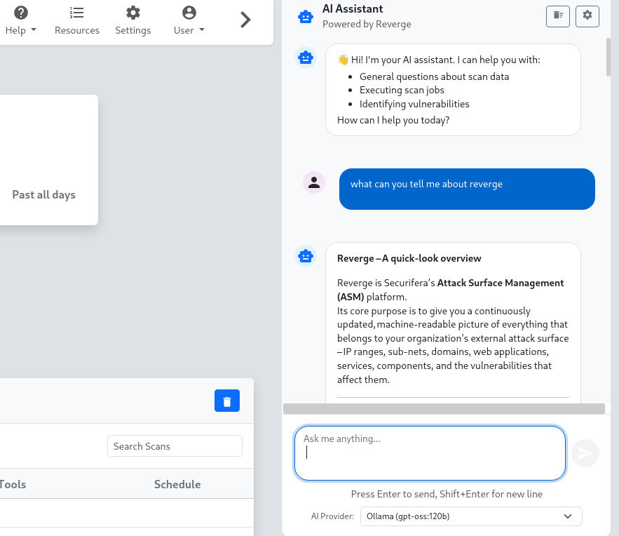

The AI Assistant provides intelligent chat-based support for analyzing scan data, executing tasks, and answering questions about your reconnaissance activities. The assistant integrates seamlessly with your Reverge workflow and maintains context awareness of your current work.
 
## Overview
The AI Assistant appears as a resizable chat panel on the right side of the interface, providing real-time AI-powered assistance without interrupting your main workflow. The assistant can help with data analysis, vulnerability identification, scan execution, and general security questions.
 
 

 
 
## Getting Started

### **Accessing the AI Assistant**
The AI assistant panel is available on most pages within Reverge. Look for the chat panel on the right side of your screen. If not visible, it may be collapsed - look for an expand button or toggle.

### **Selecting an AI Provider**
Before using the assistant, you must select an AI provider from the dropdown at the bottom of the chat panel. The available providers depend on your configured AI models in the settings.
 
 

 
## Chat Interface

### **Sending Messages**
- **Type your message** in the input field at the bottom of the panel
- **Press Enter** to send your message
- **Press Shift+Enter** to add a new line without sending
- **Click the send button** (📤) to send your message

### **Message Types**
- **User messages** appear in blue bubbles on the right side
- **AI responses** appear in white bubbles on the left side with the AI avatar
- **Streaming responses** show content as it's being generated with a typing cursor
 
## Features

### **Context Awareness**
The AI assistant automatically understands your current context:
- **Scan Data**: When viewing scan results, the assistant can analyze findings
- **Target Information**: When on target pages, the assistant knows the target details
- **Port Analysis**: When examining specific ports, the assistant has port context
- **Vulnerability Data**: The assistant can reference current vulnerability findings

### **Chat Persistence**
- **Server-Side Storage**: Chat history is saved to the Reverge database and persists across sessions, devices, and browser restarts
- **Per-User History**: All conversations are scoped to your account and only visible to you
- **Session Browser**: Access previous conversations at any time using the history panel
- **Automatic Continuation**: Returning to the assistant resumes where you left off in your most recent session

### **Streaming Responses**
- **Real-time Generation**: See AI responses as they're being generated
- **Cancellable Requests**: Stop generation mid-stream if needed
- **Connection Recovery**: Automatic handling of connection issues

## Advanced Features

### **Chat History Panel**

- **Browse Sessions**: Click the history button (🕐) in the header to open the history sidebar listing all previous conversations
- **Resume a Session**: Click any session in the list to load its messages and continue the conversation
- **Search History**: Use the search bar in the history panel to run a full-text search across all past messages
- **Delete Sessions**: Remove individual sessions from the history panel using the delete button next to each entry

### **Panel Management**

- **Resizable Panel**: Drag the left edge to resize the chat panel horizontally

- **Size Constraints**: Panel maintains minimum (300px) and maximum (800px) widths

- **Auto-height**: Panel automatically adjusts to your browser window height

### **Markdown Support**
The AI assistant supports rich text formatting:

- **Code Blocks**: Properly formatted code snippets with syntax highlighting

- **Lists**: Bulleted and numbered lists for organized information

- **Emphasis**: Bold and italic text formatting

- **Headers**: Structured content with headers and subheaders

## Use Cases

### **Scan Analysis**
Ask the assistant to help interpret scan results:

- *"What vulnerabilities were found in the latest scan?"*

- *"Explain the significance of open port 445"*

- *"What's the risk level of the discovered services?"*

### **Task Execution**
Request help with specific tasks:

- *"Schedule a scan for this target"*

- *"How do I configure a custom scan profile?"*

- *"Show me recent scan history"*

### **Vulnerability Research**
Get detailed information about security issues:

- *"Tell me about CVE-2023-1234"*

- *"What are the best practices for securing Apache servers?"*

- *"How critical is this SQL injection finding?"*

### **Data Queries**
Ask questions about your reconnaissance data:

- *"How many hosts were discovered this week?"*

- *"What domains are associated with this target?"*

- *"Show me all findings for port 80"*

## Chat Controls

### **Header Controls**
- **New Chat** (➕): Start a fresh conversation (previous sessions remain in history)
- **History** (🕐): Open the chat history panel to browse, search, and resume past conversations
- **Clear Chat** (🧹): Clear the current conversation view while keeping it in history
- **Settings** (⚙️): Quick access to AI model configuration settings

### **Input Controls**
- **Send Button**: Changes to a stop button during AI generation

- **Provider Selection**: Choose between configured AI providers

- **Auto-resize Input**: Text area expands as you type longer messages

## Troubleshooting

### **No AI Providers Available**
If you see "No providers configured":

1. Navigate to **Settings > AI Models**

2. Configure at least one AI provider

3. Return to refresh the AI assistant

### **Connection Issues**
If responses aren't generating:

- Check your internet connection

- Verify AI provider API credentials in settings

- Try selecting a different AI provider

- Refresh the page and try again

### **Slow Responses**

- Some AI providers may have slower response times

- Try switching to a faster provider if available

- Check for rate limiting in your AI provider account

### **Chat History Lost**

- Chat history is stored server-side and tied to your user account

- History persists across browser sessions, incognito windows, and devices

- Individual sessions can be deleted from the history panel

- Contact your administrator if chat history is unexpectedly missing

## Tips and Best Practices

### **Effective Prompting**
- **Be Specific**: Include relevant details about your current task
- **Ask Follow-ups**: Build on previous responses for deeper analysis
- **Use Context**: Reference specific scan results or targets when applicable

### **Performance Optimization**
- **Clear Old Chats**: Regularly clear chat history for better performance
- **Choose Appropriate Providers**: Use faster providers for simple queries
- **Cancel Unneeded Requests**: Stop generation if the response isn't helpful

### **Privacy Considerations**
- **Sensitive Data**: Be mindful of what information you share with AI providers
- **API Costs**: Some providers charge per token - monitor usage
- **Data Retention**: Check your AI provider's data retention policies

**Security Note: Be cautious when sharing sensitive reconnaissance data with external AI providers. Consider using local models (Ollama) for highly sensitive information.**