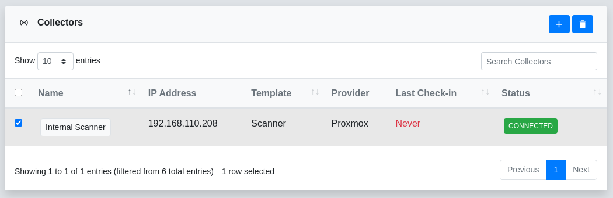
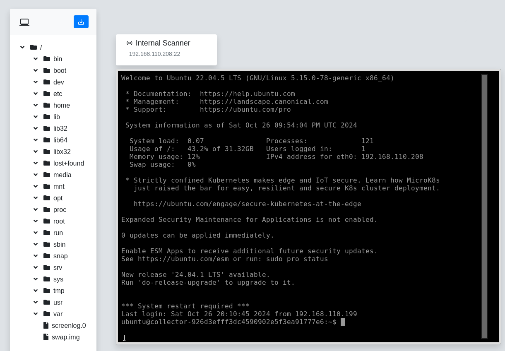

A collector is a virtual machine that reverge uses to perform network scans against target networks. Collectors can be instantiated from [providers](/settings/providers/) that are defined in the **Settings** menu or defined manually.

## Add Collector
To add a new collector to reverge click on the   button in the top right corner of the Collectors dialog.
<br>
<br>
<center>

</center>
<br>
<br>
Next, fill out the **Add Collector** dialog by entering the new collector's name, selecting the [provider](/settings/providers/), and selecting the template. There are currently three available templates:

- `Scanner` Installs the reverge [collector](https://github.com/securifera/reverge_collector) tools required for scanning targets.
- `Extender` No additional tools are installed. This template is typically used to setup a SSH tunnel to an unreachable Collector.
- `DNS` Registers DNS records for the given domain. *Currently only supports Njalla.*
<br>
<br>
<center>

</center>
## Remove Collector
To remove a collector from reverge, select the checkbox to the left of the collectors name in the Collectors dialog and click on the   button in the top right corner.
<br>
<br>
<center>

</center>
## Manage Collector
The Collectors menu is where you configure settings and perform various operations on the collector.
<br>
<br>
<center>

</center>

<div style="display: flex; align-items: center; padding-bottom: 10px;">
  
  <span>Opens a remote terminal to the collector</span>
</div>
<div style="display: flex; align-items: center; padding-bottom: 10px;">
  
  <span>Rotates the IP address on the collector (Cloud only)</span>
</div>
<div style="display: flex; align-items: center; padding-bottom: 10px;">
  
  <span>Toggles the SSH tunnel to the collector</span>
</div>
<div style="display: flex; align-items: center; padding-bottom: 10px;">
  
  <span>Toggles the power on the collector</span>
</div>
<div style="display: flex; align-items: center; padding-bottom: 10px;">
  
  <span>Destroys the collector</span>
</div>
To update a collector's configuration, edit one of the fields in the **Configuration** dialog and click on the   button in the top right corner of the Configuration dialog.
## Remote Access
If you click on the  button, a new window will be opened that renders a virtual remote shell on the selected collector. This interface can be used to troubleshoot issues with the collector or manually execute commands.
<br>
<br>
<center>

</center>
<br>
<br>
If you click on the  button in the top left of the screen, a side menu will open that allows for downloading files from the remote system. To download a file, navigate to the file in the file system tree and then click the  button.
<br> 
<br>
<br>
<center>

</center>
## Advanced
Although most scanning is typically performed using deployed collectors through reverge, you can also set up a collector manually. This is especially useful when you need to perform scans on an **internal network**. For this to work a pivot server has to port forward traffic between the reverge server and the collector. The following instructions will guide you through how to set this up.
<br>
<br>
Click on the   button in the top right corner of the Collectors dialog.

In the **Add Collector** dialog, select **Manual** in the **Provider** drop down menu. Enter the IP address for the internet accessible pivot server, the port for the SSH port forward, and the username for the internal scanner docker (root). Generate a [SSH pubic/private key](https://www.ssh.com/academy/ssh/keygen). Do not add a password as this key will be managed by reverge.  Click the **Browse** button and select the private key file. Click the **Add** button.
<br>
<br>
<center>

</center>

Click on the newly created collector in the table. Copy the value in the **API Key** field.
<br>
<br>
<center>

</center>

### On the Pivot Server
Open /etc/ssh/sshd_config and update the following field
```
GatewayPorts clientspecified

```
<br>
Restart the SSH server
```
service sshd restart
```
<br>
Generate a [SSH pubic/private key](https://www.ssh.com/academy/ssh/keygen) that will be used between the scan system and the pivot server.
Add the public key to the authorized_keys for the user performing the port forward.
```
cat pivot.pub >> ~/.ssh/authorized_keys
```
<br>
### On the Scanner
Manually install the [reverge-collector](https://github.com/securifera/reverge_collector) software on the system intended to peform scans
```
git clone https://github.com/securifera/reverge_collector.git
```
<br>
Copy the previously generated SSH public key to the scanning system. Fill in the appropriate file path to the SSH public key and the copied collector API key in the command below. Generate the collector docker image on the scanning system.

```
docker build --build-arg sshkey="id_rsa.pub" --build-arg apikey="<API KEY FOR COLLECTOR >" -t collector:test1 .
```
<br>
Start a docker instance of the collector software

```
docker run --name collector1 -p 2222:22 -d collector:test1
```
<br>
Copy the SSH private key to the scan system
Create a port forward from the collector docker to the pivot server. In the example below, port **2222** is being opened on the pivot server to forward connections to the internal collector docker. <span style="color: red;">**Please ensure whatever port is opened on the pivot server is added to any firewall exception lists.**</span>
```
screen -S ssh_session
ssh -t -t -N -i pivot.pem -R *:2222:localhost:2222 -o ServerAliveCountMax=3 <USERNAME>@<PIVOT SERVER IP>
```
<br>
### On the Reverge Server
Click on the   button to connect through the pivot server to the internal docker collector instance. If everything is properly setup, the status should change to **Connected**. If it doesn't, the most common issues are associated with SSH or firewall rules.
<br>
<br>
<center>

</center>