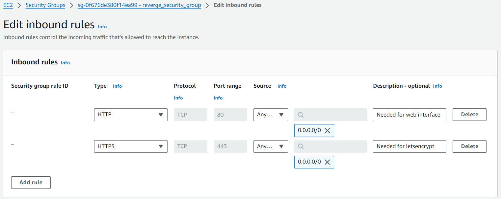
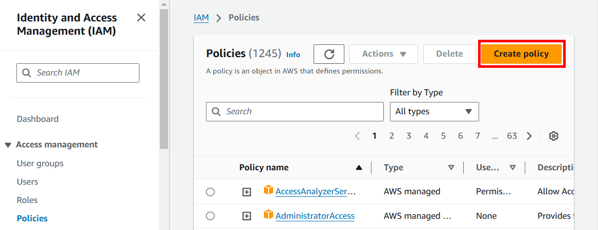
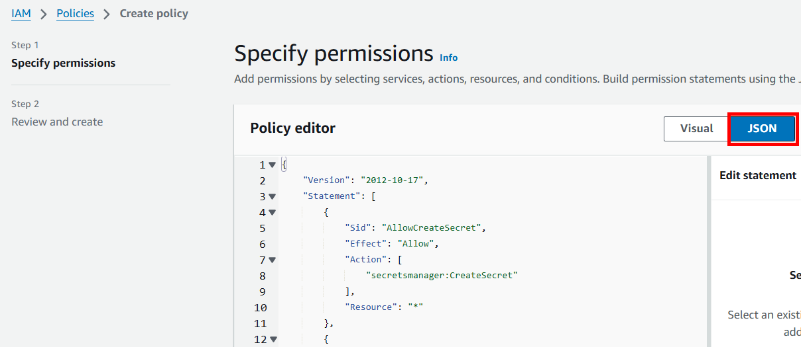
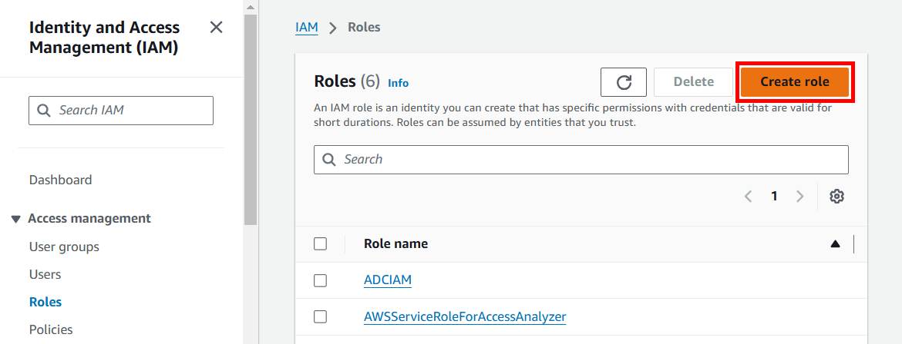
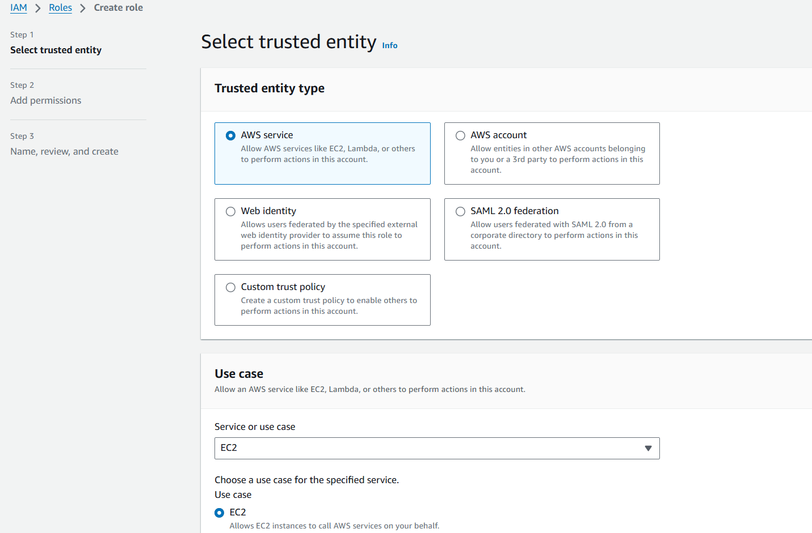
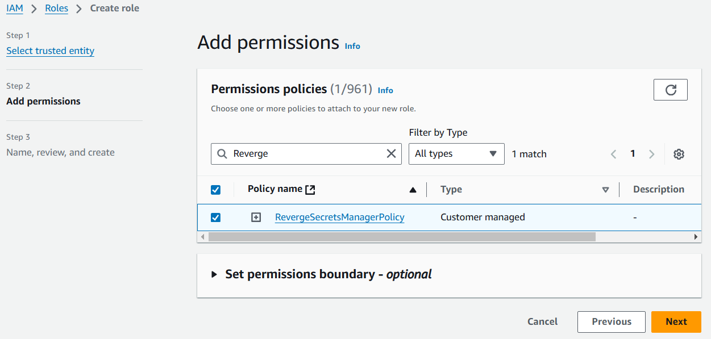
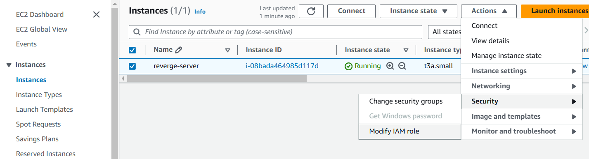
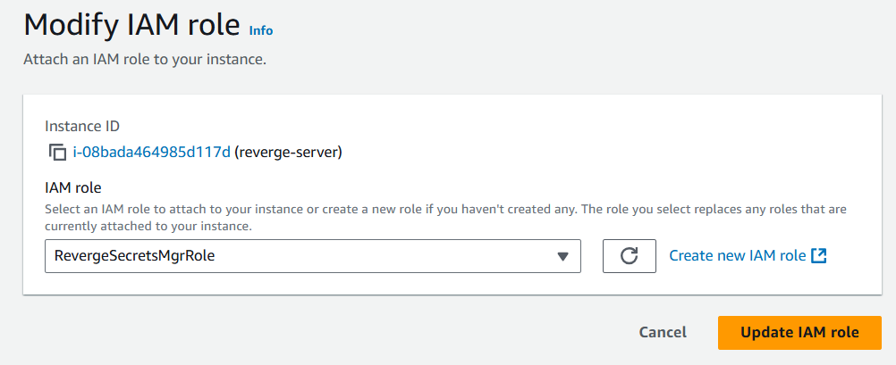

reverge is a attack surface management (ASM) framework. One of its primary functions includes collecting information about a target's network through network scanning and open-source intelligence gathering. By thoroughly analyzing systems and networks, reverge identifies vulnerabilities, network services, web applications, and potential security risks that contribute to an organization's attack surface. It also enables an organization to actively track assets and exposures, assisting in the reduction of its attack surface, strengthening defenses and mitigating potential threats.


## Installation

Goto [Amazon Marketplace](https://aws.amazon.com/marketplace/pp/prodview-6z2kypjrj3ehk) and deploy a reverge instance


**When configuring the security groups for the EC2 instance consider the following:**

* reverge web interface is running on port **80**
* TLS certificate issuance using Letsencrypt requires port **443** open to the internet
* SSH port forwarding for a remote database is running on port **22**

<br>

<br>

## Secrets Manager

reverge stores various sensitive third-party credentials used to interact with cloud services and other applications. By default, these credentials are encrypted with a key that is also stored in the database, offering minimal protection if the database is compromised. However, reverge offers the ability to utilize [AWS Secrets Manager](https://aws.amazon.com/secrets-manager/) to store the encryption key separately, thereby providing an extra layer of security for the stored credentials.

After setting up a reverge AWS instance, it is strongly recommended to create an AWS IAM role accompanied by a suitable permission policy. This setup will enable the creation and retrieval of the reverge encryption key. Once the role is created, attach it to the reverge EC2 instance.

The following steps will walk you through setting up a IAM policy & role and attaching it to the reverge EC2 instance.

1. Login to the AWS console and navigate to **Identity and Access Managament (IAM)**
2. Cick on **Policies** in the menu on the left of the screen
3. Click the **Create policy** button
<br>
<br>
<center>

</center>
4. Click the **JSON button** in the **Policy editor** dialog
<br>
<br>
<center>

</center>
5. Copy and paste the following JSON policy into the policy editor and click **Next**
```
{
    "Version": "2012-10-17",
    "Statement": [
        {
            "Sid": "AllowCreateSecret",
            "Effect": "Allow",
            "Action": [
                "secretsmanager:CreateSecret"
            ],
            "Resource": "*"
        },
        {
            "Sid": "AllowManageOwnSecrets",
            "Effect": "Allow",
            "Action": [
                "secretsmanager:DescribeSecret",
                "secretsmanager:GetSecretValue",
                "secretsmanager:UpdateSecret",
                "secretsmanager:DeleteSecret",
                "secretsmanager:ListSecretVersionIds"
            ],
            "Resource": "arn:aws:secretsmanager:*:*:secret:reverge_key*"
        }
    ]
}

```

6. Fill in the **Policy name** field, e.g. RevergeSMPolicy, in the **Policy details** dialog and click the **Create policy** button at the bottom of the screen.
7. Cick on **Roles** in the menu on the left of the screen
8. Click the **Create role** button
<br>
<br>
<center>

</center>
9. Select the **AWS service** radio button (default) in the **Trusted entity type** dialog. Select **EC2** in the **Service or use case** drop down input field in the **Use case** dialog. Click the **Next** button
<br>
<br>
<center>

</center>
10. Type in the name of the policy created in step 6 in the search field in the **Permissions policies** dialog. Click the checkbox beside the correct policy name in the policy table. Click the **Next** button
<br>
<br>
<center>

</center>
11. Fill in the **Role name** field in the **Role details** dialog and click the **Create role** button
12. Navigate to **EC2** in the AWS services menu
13. Click on **Instances** in the menu on the left of the screen
14. Click the checkbox beside the reverge server instance. Click the **Actions** drop down menu at the top of the page. Click **Security** -> **Modify IAM role**
<br>
<br>
<center>

</center>
15. Select the IAM role created in step 11 and click the **Update IAM role**
<br>
<br>
<center>

16. Congratulations! You have given the reverge server permission to use the AWS Secrets Manager