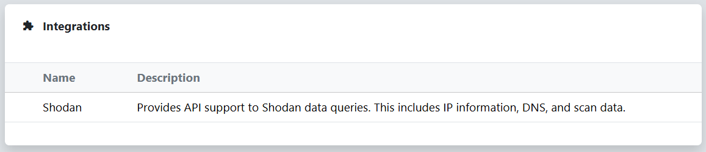
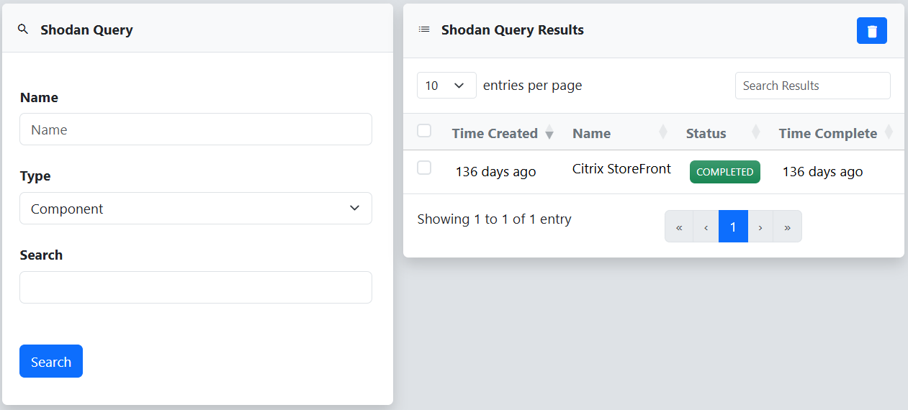
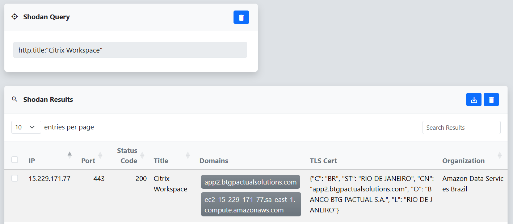

An integration in reverge is a custom plugin designed to enhance the platform’s capabilities by connecting to third-party services. It fetches external data and makes it easy to import that information back into reverge for further analysis. 
 
 

 
 
## Shodan
The Shodan integration provides an interface for executing custom Shodan queries. The **Type** field has a predefined set of query filters that can be selected. After selecting a type and entering the search value, click the **Search** button to execute the query. An entry will be created in the **Shodan Query Results** table that can be selected to review the results.
 
 

 
 
### Results
If you click on an entry in the **Shodan Query Results** table, you will be redirected to a new page that displays the results delivered from Shodan. The **Shodan Results** table lists basic information about each result to include IP Address, Port, Status Code, Domains, Certificates, etc.
 
 

 
 