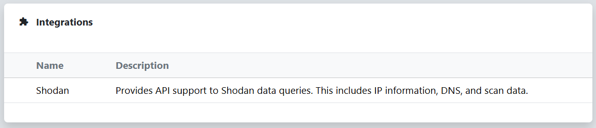
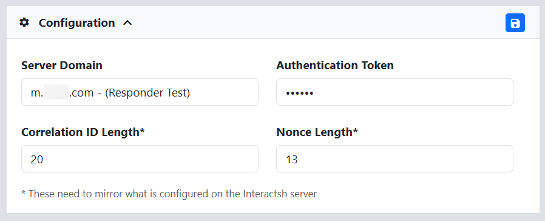
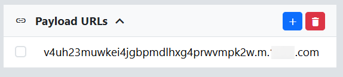
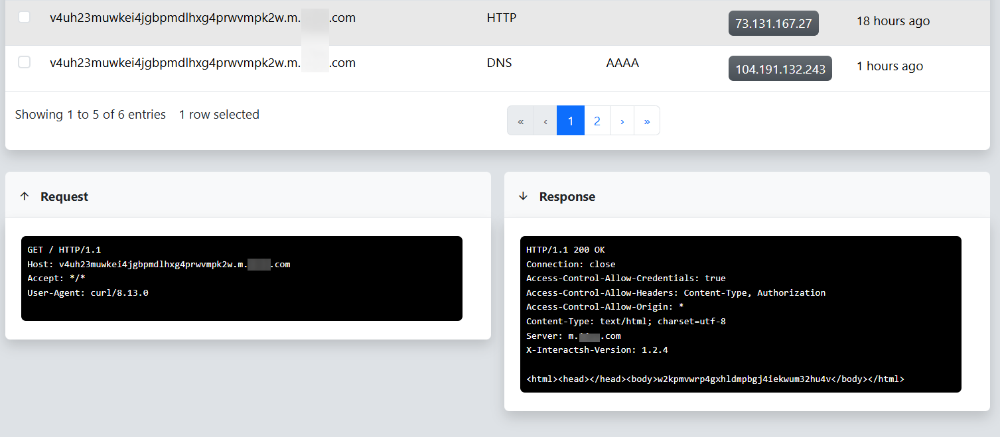
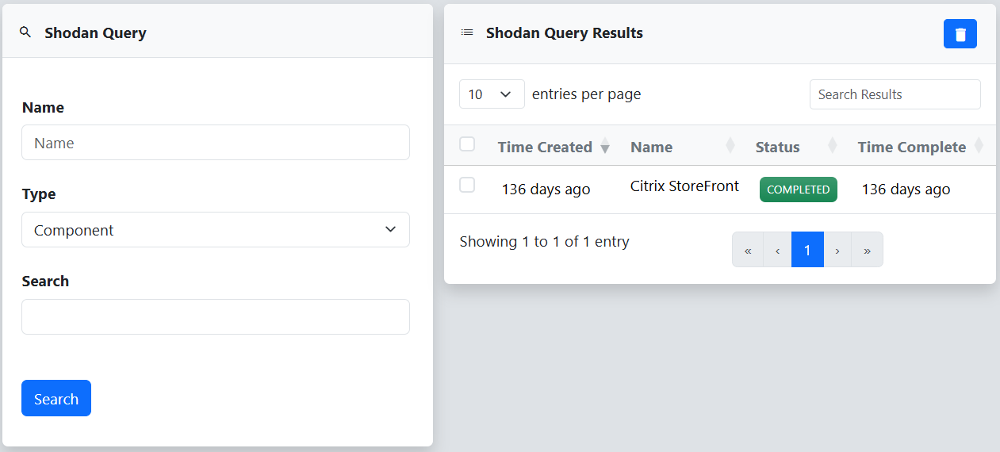
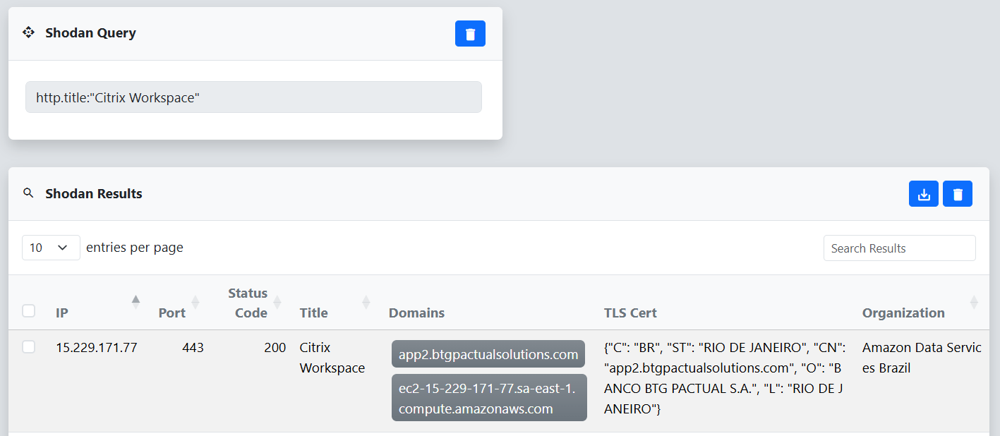

An integration in reverge is a custom plugin designed to enhance the platform’s capabilities by connecting to third-party services. It fetches external data and makes it easy to import that information back into reverge for further analysis. 
 
 

 
 
## Interactsh
The Interactsh integration provides an interface for managing out-of-band interaction payloads and monitoring for callbacks. Configure the Interactsh server domain, authentication token, and parameters, then register payloads to receive interaction data.
 
 
### Configuration
The **Configuration** panel allows you to set up your Interactsh server connection:

- **Server Domain**: Select from available Responder collectors or enter a custom Interactsh server domain (e.g., `oast.pro`, `oast.live`)
- **Authentication Token**: Optional API token for authenticated requests to your Interactsh server
- **Correlation ID Length**: Minimum length of the correlation ID (default: 20, minimum: 2)
- **Nonce Length**: Length of the nonce component (default: 13, minimum: 3)

Click the **Save** button to persist your configuration.
 
 

 
 
### Payload URLs
The **Payload URLs** panel displays all registered payloads. Click **Add** to register a new payload with your configured Interactsh server, or select payloads and click **Delete** to deregister them.
 
 

 
### Interactions
The **Interactions** table displays all received out-of-band interactions from your payloads, including:

- **Payload Domain**: The full interaction domain where the callback was received
- **Protocol**: The protocol used (HTTP, DNS, etc.)
- **Request Type**: The type of request (GET, POST, etc.)
- **IP Address**: Source IP address of the interaction
- **Created**: Timestamp when the interaction was received

Click on an interaction row to view the full **Request** and **Response** details in the panels below.
 
 

 
 
 
 
## Shodan
The Shodan integration provides an interface for executing custom Shodan queries. The **Type** field has a predefined set of query filters that can be selected. After selecting a type and entering the search value, click the **Search** button to execute the query. An entry will be created in the **Shodan Query Results** table that can be selected to review the results.
 
 

 
 
### Results
If you click on an entry in the **Shodan Query Results** table, you will be redirected to a new page that displays the results delivered from Shodan. The **Shodan Results** table lists basic information about each result to include IP Address, Port, Status Code, Domains, Certificates, etc.
 
 

 
 