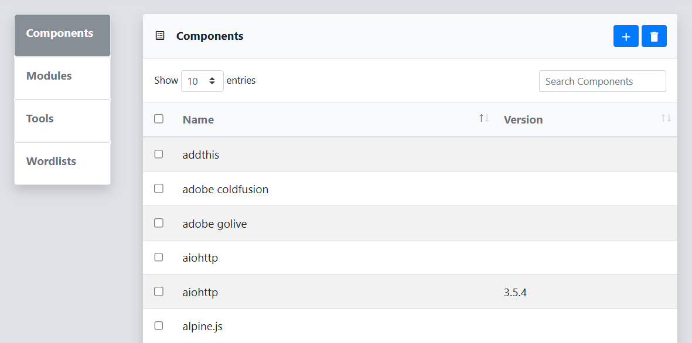

The **Components** menu displays a table of components that have been detected by reverge collectors or manually entered. A component represents a software application or service running on a target system and its associated version. Components can be bound to [modules](/resources/modules/) to trigger the execution of a specific tool module.
 
 

 
 