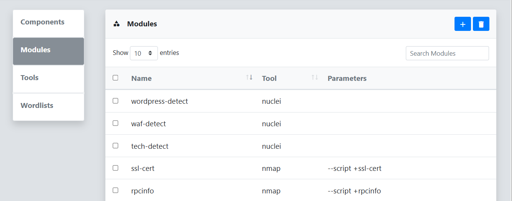
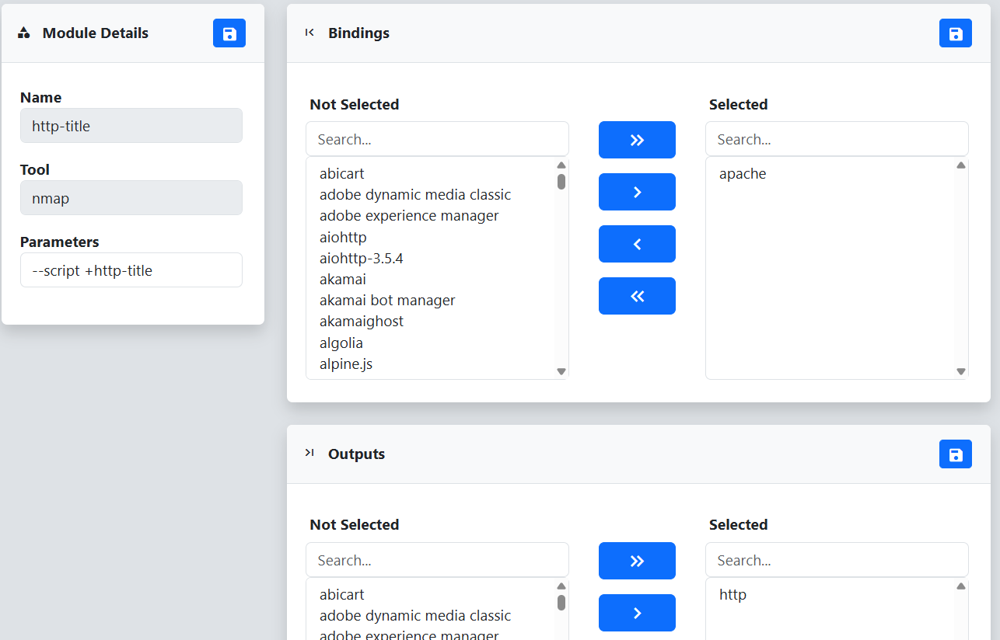

The **Modules** menu lists all the tool modules that are gleaned from scan results by reverge or manually defined. The purpose of this menu is to allow for the binding of modules to components. In other words, the execution of a specific module can be bound to the detection of a particular component. For example, if the **nginx** component is detected, execute the **nginx-version** nuclei module.
 
 

 
If you click on a module in the list you will be taken to the **Module Details** page. From here you can associate modules with particular components that will affect when modules are executed if the **Module** scan tool is selected. The **Bindings** dialog allows you to select what components trigger the execution of the particular module. The **Outputs** dialog allows for mapping components if the module output contains the component name, in which case that component will be associated with the particular port.
 
 

