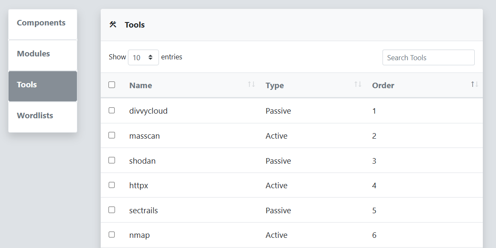

The Tools menu displays all tools registered with reverge by its collectors. When a collector connects to reverge, it reports the list of tools it has available. This menu allows you to configure default parameters, set API keys, adjust tool scan order, and manage tool classification settings.
 
 

 
 
To update a tool's configuration, click on the tool row in the **Tools** Dialog table. The **Tool Details** and **Wordlists** dialog will be displayed for the selected tool. If a tool requires an API key to operate, enter it here. The **Wordlists** dialog allows you to select what wordlists should be made available to the tool during scanning. After making changes, click the **Save** button.
 
 

 
 