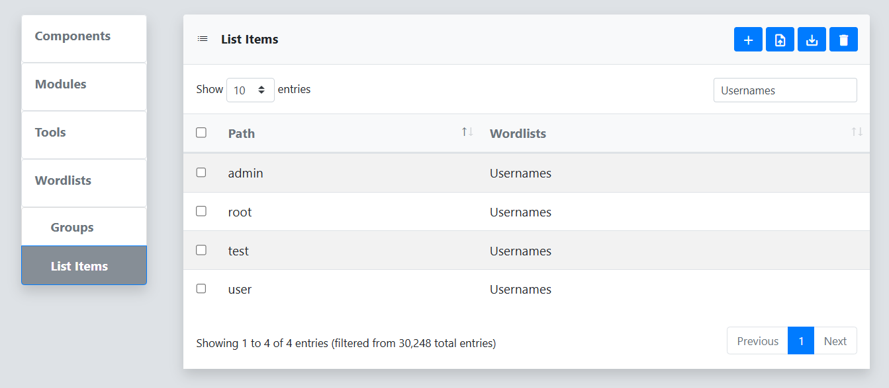

The **Wordlists** menu includes two sub-menus: **Groups** and **List Items**. **List Items** are unique strings that can be organized into **Groups** and used as wordlists for various tools in Reverge. Some example **List Items** include website endpoints, HTTP requests parameters, usernames, and passwords.
 
 

