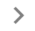

Scan results can be accessed from two different places in reverge. The main **Dashboard** menu lists scans that have been executed against any target in reverge. The second place is from the **Targets** menu under each specific target. After clicking on a target, click the **Scans** submenu in the top right dialog. To view the details of a scan, click on the corresponding row in the scan table. 

The default page will display basic details about the scan and list all hosts identified. This view will show the IP address for each host,  any domains associated with it, and the number of open ports detected.
 
 

 
 
To access detailed information about each host's ports, click on the corresponding row in the scan table. This will open a detailed view showing all open ports for that host, the components running on them, and any screenshots that have been collected.
 
 
 

 
 
## Jobs
If you want details on what scan jobs have been executed in the particular scan, click on the **Jobs** menu at the top right of the scan page. This table will display each tool that was executed, any additional arguments, the target hosts/domains/ports, and the execution status. This table can be exported in JSON format by clicking the  button. To view up-to-date scan logs related to the execution of scan jobs, visit the collector details panel for the associated [Collector](/collectors/collectors/#manage-collector)
 
 

 
 
## Filter
If you're viewing a very large scan and need to filter the results, click on the  button located in the top-left corner of the screen. This will display a filter menu that provides a mechanism for narrowing down the displayed results according to your specific criteria.
 
 
To filter the results, select the desired checkboxes and click the **Filter** button.
 
 

 
 
## Port Details
To view detailed information about each port, click on the corresponding row in the port table. This will open a detailed view listing the components associated with the port, domains extracted from TLS certificates, modules scan results, and HTTP endpoints and their respective screenshots.
 
 

 
 