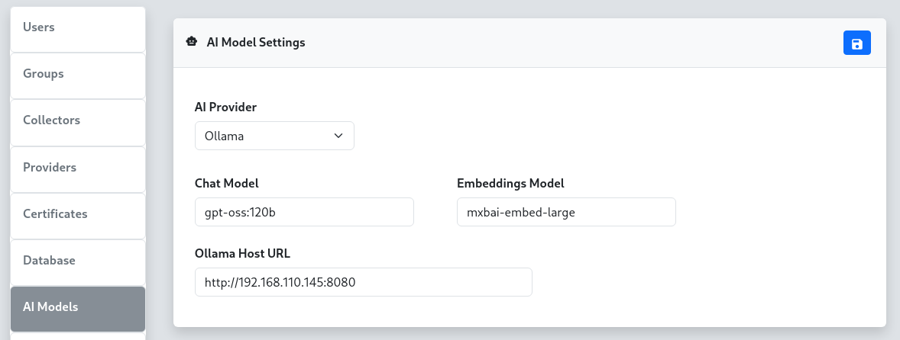

To configure AI model integration for the reverge chat functionality, select the appropriate AI provider and configure the required settings. There are five supported AI providers: **OpenAI**, **Anthropic**, **Google**, **Ollama**, and **Snowflake**.
<br>
<br>
<center>

</center>
<br>
<br>
## OpenAI Configuration
For the **OpenAI** provider, configure the chat model, embeddings model, and API token. OpenAI offers powerful language models including GPT-4 and GPT-3.5-turbo for chat functionality.
<br>
<br>
**Configuration Fields:**
<br>
- **Chat Model**: Specify the OpenAI model for chat interactions (e.g., `gpt-5.1-2025-11-13`, `gpt-5-2025-08-07`)
<br>
- **Embeddings Model**: Specify the model for text embeddings (e.g., `text-embedding-3-small`)
<br>
- **API Token**: Your OpenAI API key for authentication


## Anthropic Configuration
For the **Anthropic** provider, configure the chat model and API token. Anthropic's Claude models provide advanced conversational AI capabilities.
<br>
<br>
**Configuration Fields:**
<br>
- **Chat Model**: Specify the Anthropic model (e.g., `claude-sonnet-4-5`, `claude-haiku-4-5`)
<br>
- **API Token**: Your Anthropic API key for authentication


## Google Gemini Configuration
For the **Google** provider, configure the chat model, embeddings model, and API token. Google's Gemini models offer multimodal AI capabilities.
<br>
<br>
**Configuration Fields:**
<br>
- **Chat Model**: Specify the Gemini model (e.g., `gemini-2.5-pro`)
<br>
- **Embeddings Model**: Specify the model for text embeddings (e.g., `gemini-embedding-001`)
<br>
- **API Token**: Your Google AI API key for authentication
<br>
## Ollama Configuration
For the **Ollama** provider, configure the chat model, embeddings model, and host URL. Ollama allows you to run large language models locally or on your own infrastructure.
<br>
<br>
**Configuration Fields:**
<br>
- **Chat Model**: Specify the Ollama model (e.g., `llama2`, `mistral`, `gpt-oss:120b`)
<br>
- **Embeddings Model**: Specify the model for text embeddings (e.g., `mxbai-embed-large`)
<br>
- **Ollama Host URL**: The URL of your Ollama server (e.g., `http://192.168.110.100:8080`)
<br>
<br>
### Remote Ollama Setup
For locally hosted Ollama instances, you can set up SSH port forwarding to connect your local Ollama server to the reverge server, similar to the remote database configuration. Execute the following SSH port forward command from your local machine where Ollama is running. Be sure to replace REVERGE_IP_ADDRESS with the reverge server IP address.
<br>
<br>
```
ssh -i priv_key ubuntu@REVERGE_IP_ADDRESS -p22 -N -R 8181:127.0.0.1:8080
```
<br>
Once the port forward connection is established, configure the **Ollama Host URL** to use the forwarded port (e.g., `http://localhost:8181`).


## Snowflake Configuration
For the **Snowflake** provider, configure the chat model, Personal Access Token, and account identifier. Snowflake Cortex AI provides access to enterprise-grade frontier models including Claude, hosted within your Snowflake environment.
<br>
<br>
**Configuration Fields:**
<br>
- **Chat Model**: Specify the Snowflake Cortex model (e.g., `claude-sonnet-4-5`, `claude-opus-4-5`)
<br>
- **Personal Access Token (PAT)**: Your Snowflake Personal Access Token for authentication
<br>
- **Account Identifier**: Your Snowflake account identifier (e.g., `myorg-myaccount`). The full hostname is resolved automatically.


## Configuration Steps
1. **Select AI Provider**: Choose your preferred AI provider from the dropdown menu
2. **Configure Models**: Enter the appropriate model names for your selected provider
3. **Set Authentication**: Provide the required API token, PAT, or host URL
4. **Save Settings**: Click the  button to apply the configuration


---

## Backend Engine

Reverge uses [**Goose**](https://github.com/block/goose) as the AI agent engine that powers the chat assistant. Goose is an open-source, agentic AI framework that manages tool execution, context, and multi-step reasoning on top of the configured LLM provider. The `goosed` process runs as a local service on the Reverge server; the chat panel communicates with it over a secure internal API.

Goose's provider-agnostic design is what allows Reverge to support OpenAI, Anthropic, Google, Ollama, and Snowflake through a single settings panel.

---

## Agents

Agents are named AI personas with a custom system prompt. When a user selects an agent in the chat panel, that agent's prompt is injected into the session, shaping how the assistant behaves and what it focuses on.

### Managing Agents

- Navigate to **Settings → AI** and scroll to the **Agents** panel.
- Click **+** to open the **Add Agent** dialog.
- Fill in the following fields:
  - **Name** — a short identifier for the agent (e.g. `recon-agent`)
  - **Description** — one-sentence summary of the agent's purpose
  - **Prompt** — the full system prompt the agent uses (e.g. `You are an AI assistant specialized in external attack surface reconnaissance...`)
- Click **Save** to create the agent.

### Assigning Skills to an Agent

Click any agent row to open the **Skills** assignment panel on the right. Move skills between the *Not Assigned* and *Assigned* lists, then click  to save the assignment. Assigned skills are injected into the agent's context automatically.

### Built-in Agents

Built-in agents (marked with a lock icon) are provided by Reverge and cannot be deleted. They can still have skills assigned to them.

---

## Skills

Skills are reusable knowledge documents written in Markdown. They let you encode domain expertise, playbooks, or reference material that any agent can draw on. A skill assigned to an agent is included in that agent's context window for every session.

### Managing Skills

- Scroll to the **Skills** panel in **Settings → AI**.
- Click **+** to open the **Add Skill** dialog.
- Fill in the following fields:
  - **Name** — a short identifier for the skill (e.g. `port-scanning-guide`)
  - **Description** — one-sentence summary shown to the AI so it knows when to apply the skill
  - **Content (Markdown)** — the full skill document; supports standard Markdown including headings, lists, code blocks, and tables
- Click **Save** to create the skill.

### Editing Skills

Click any skill row to open the inline **Edit Skill** panel on the right. Modify the name, description, or Markdown content and click  to save.

---

---

## Auto Mode

Auto Mode enables a fully autonomous penetration testing loop. When activated from the chat panel, a dedicated **Auto Mode Operator** agent takes over: it reviews the current Reverge data (hosts, open ports, scan results), formulates a directive, hands it to the Reverge AI agent for execution, inspects the result, and repeats — continuing until the objective is complete or a configured limit is reached.
<br>
<br>
All scan jobs launched during an Auto Mode session are routed through the Reverge scheduler so they remain auditable and cancellable.

### Auto Mode Configuration

Navigate to **Settings → AI** and scroll to the **Auto Mode** panel to configure global limits that apply to every Auto Mode session.
<br>
<br>
**Configuration Fields:**
<br>
- **Max Turns** — Maximum number of operator → agent turn cycles. Set to `0` for no limit. Each "turn" counts as one full operator directive plus one agent response.
<br>
- **Max Time (min)** — Wall-clock time limit in minutes after which Auto Mode stops automatically. Set to `0` for no limit.
<br>
- **Max Tokens** — Total token budget (input + output combined across both the operator and agent). Set to `0` for no limit. The running token count is displayed live in the chat panel.
<br>
- **Stop on Significant Findings** — When enabled, the operator is instructed to declare the objective complete as soon as a critical or high-severity vulnerability is confirmed in the Reverge database, even if not every attack vector has been explored.

### Auto Mode Operator Agent

The **Auto Mode Operator** is a built-in agent (marked with a lock icon in the Agents list) that drives the autonomous loop. Its system prompt can be viewed and customised via **Settings → AI → Agents**, and MCP servers or skills can be assigned to it just like any other agent. The operator has full read access to Reverge data tools so it can make informed decisions between turns.

---

## Troubleshooting
- **API Authentication Errors**: Verify your API tokens are correct and have sufficient permissions
- **Connection Issues**: For Ollama, ensure the host URL is accessible and the service is running
- **Model Availability**: Confirm the specified models are available in your account/instance
- **Rate Limiting**: Some providers have rate limits; consider upgrading your plan if needed
- **Agent not appearing in chat**: Ensure the agent has been saved and the page has been refreshed
- **Skill not taking effect**: Confirm the skill is assigned to the active agent and the agent is selected in the chat panel
- **Auto Mode not stopping**: Use the **Auto Mode** toggle in the chat panel to stop the loop manually at any time

<span style="color: red;">**Note: API keys are sensitive information. Ensure they are kept secure and have appropriate access