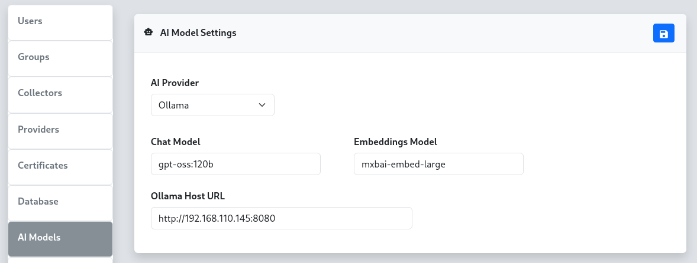

To configure AI model integration for the reverge chat functionality, select the appropriate AI provider and configure the required settings. There are four supported AI providers: **OpenAI**, **Anthropic**, **Google**, and **Ollama**.
<br>
<br>
<center>

</center>
<br>
<br>
## OpenAI Configuration
For the **OpenAI** provider, configure the chat model, embeddings model, and API token. OpenAI offers powerful language models including GPT-4 and GPT-3.5-turbo for chat functionality.
<br>
<br>
**Configuration Fields:**
<br>
- **Chat Model**: Specify the OpenAI model for chat interactions (e.g., `gpt-5.1-2025-11-13`, `gpt-5-2025-08-07`)
<br>
- **Embeddings Model**: Specify the model for text embeddings (e.g., `text-embedding-3-small`)
<br>
- **OpenAI API Token**: Your OpenAI API key for authentication


## Anthropic Configuration
For the **Anthropic** provider, configure the chat model and API token. Anthropic's Claude models provide advanced conversational AI capabilities.
<br>
<br>
**Configuration Fields:**
<br>
- **Chat Model**: Specify the Anthropic model (e.g., `claude-sonnet-4-5`, `claude-haiku-4-5`)
<br>
- **Anthropic API Token**: Your Anthropic API key for authentication


## Google Gemini Configuration
For the **Google** provider, configure the chat model, embeddings model, and API token. Google's Gemini models offer multimodal AI capabilities.
<br>
<br>
**Configuration Fields:**
<br>
- **Chat Model**: Specify the Gemini model (e.g., `gemini-2.5-pro`)
<br>
- **Embeddings Model**: Specify the model for text embeddings (e.g., `gemini-embedding-001`)
<br>
- **Gemini API Token**: Your Google AI API key for authentication
<br>
## Ollama Configuration
For the **Ollama** provider, configure the chat model, embeddings model, and host URL. Ollama allows you to run large language models locally or on your own infrastructure.
<br>
<br>
**Configuration Fields:**
<br>
- **Chat Model**: Specify the Ollama model (e.g., `llama2`, `mistral`, `gpt-oss:120b`)
<br>
- **Embeddings Model**: Specify the model for text embeddings (e.g., `mxbai-embed-large`)
<br>
- **Ollama Host URL**: The URL of your Ollama server (e.g., `http://192.168.110.100:8080`)
<br>
<br>
### Remote Ollama Setup
For locally hosted Ollama instances, you can set up SSH port forwarding to connect your local Ollama server to the reverge server, similar to the remote database configuration. Execute the following SSH port forward command from your local machine where Ollama is running. Be sure to replace REVERGE_IP_ADDRESS with the reverge server IP address.
<br>
<br>
```
ssh -i priv_key ubuntu@REVERGE_IP_ADDRESS -p22 -N -R 8181:127.0.0.1:8080
```
<br>
Once the port forward connection is established, configure the **Ollama Host URL** to use the forwarded port (e.g., `http://localhost:8181`).


## Configuration Steps
1. **Select AI Provider**: Choose your preferred AI provider from the dropdown menu
2. **Configure Models**: Enter the appropriate model names for your selected provider
3. **Set Authentication**: Provide the required API token or host URL
4. **Save Settings**: Click the  button to apply the configuration


## Troubleshooting
- **API Authentication Errors**: Verify your API tokens are correct and have sufficient permissions
- **Connection Issues**: For Ollama, ensure the host URL is accessible and the service is running
- **Model Availability**: Confirm the specified models are available in your account/instance
- **Rate Limiting**: Some providers have rate limits; consider upgrading your plan if needed

<span style="color: red;">**Note: API keys are sensitive information. Ensure they are kept secure and have appropriate access