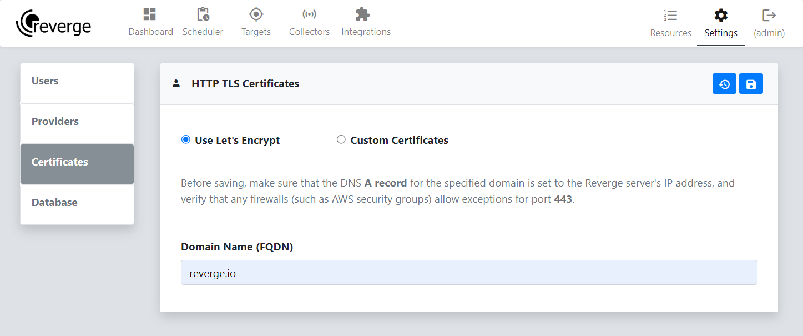
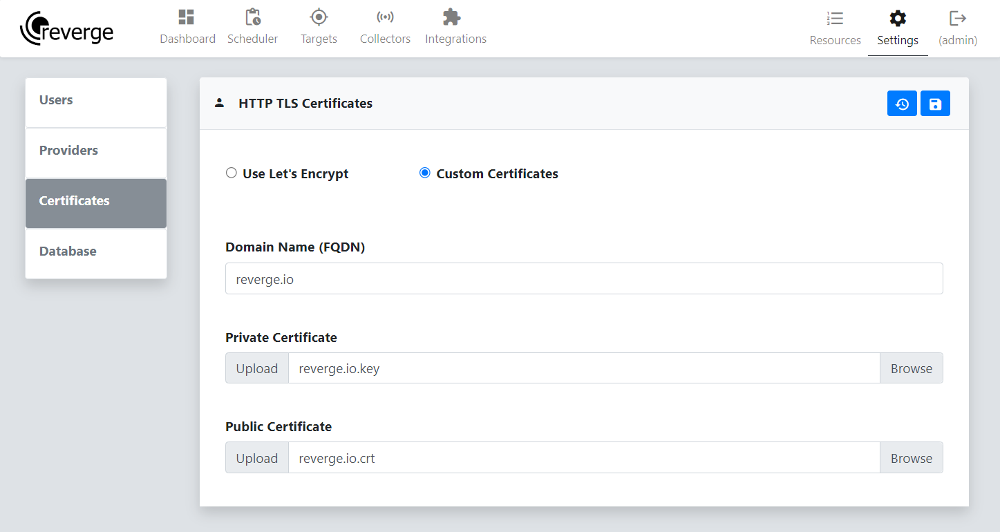

To enable TLS on the reverge web application, select the appropriate radio button. There are two supported methods, **Let's Encrypt** for automatic certificate generation or uploading custom generated TLS certificates.
 
 
## Let's Encrypt
For the **Let's Encrypt** option, enter the fully qualified domain name (FQDN) in the **Domain Name** field and click the   button. **If you do not have a DNS A record configured for the given domain and a firewall exception for port 443, this will fail.**
 
 

 
 
## Custom Certificates
For the **Custom Certificates** option, enter the fully qualified domain name (FQDN) in the **Domain Name** field. Next click the **Browse** button for the Private and Public Certificate fields and select the appropriate certificate file. Finally, click the   button.
 
 
 

 
 
## Troubleshooting
If everything worked as expected, the Reverge server should soon be reachable on port **443** at the specified domain—for example, [https://reverge.io](https://reverge.io). If not, you can restart the process by clicking the  button.
