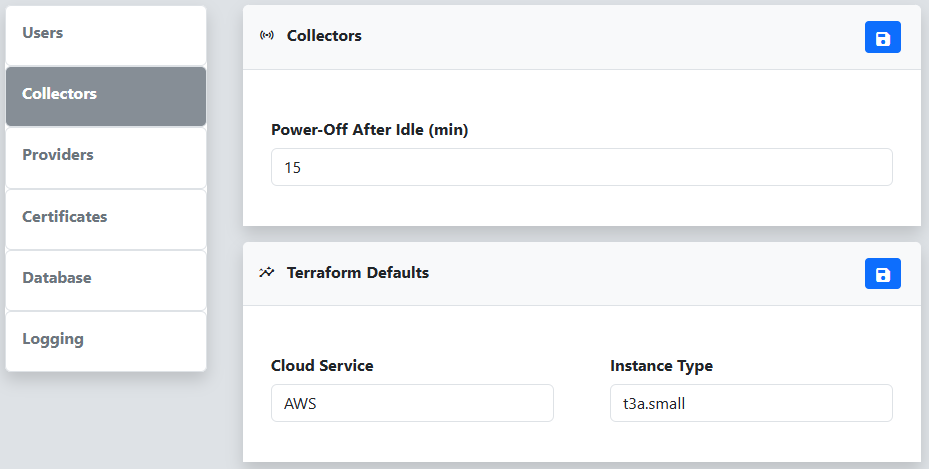

The **Collectors** menu on the Settings page allows you to configure the settings for collectors deployed and utilized by Reverge. The **Power-Off After Idle** setting determines the number of minutes to wait after a collector becomes idle before it is shut down, helping to save money on unused resources.
 
 

 
 
The **Terraform Defaults** dialog enables you to specify various settings when deploying collectors. One example is selecting the instance type (size) to be used. You can find the available instance types in the documentation provided by your respective cloud provider.
 
 

