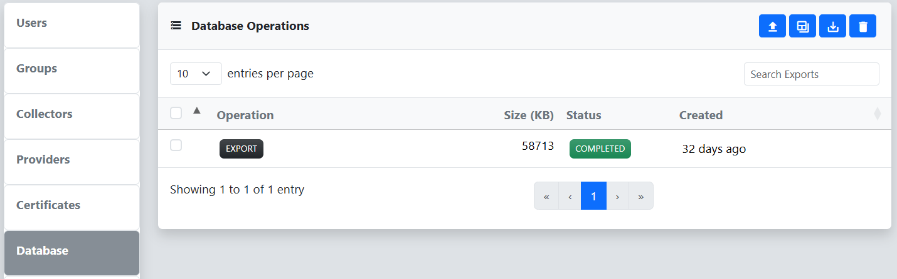

The Database menu on the Settings page can be used to backup and restore the reverge database. The primary use case for this functionality is transferring the data from one instance of reverge to another, typically when upgrading.

## Export Tables
To export the reverge database tables, Click the **Export** button at the bottom left of the **Export Database** dialog. This action will queue an export job that will be added to the table. When the job is complete, the database export can be downloaded by clicking the  button. The export file is a compressed tar archive containing reverge data in csv format and the exported table schemas.
 
 

## Import Tables
The import process is the mirror operation to the database export feature and expects a compressed tar archive that was produced by performing an **Export**. **It is highly recommmended to perform this operation immediately after installing a new reverge instance to avoid data inconsistency**. To restore a reverge database, click the **Browse** button and select a previously exported tar.gz reverge database export file. Next, click the **Import** button.

