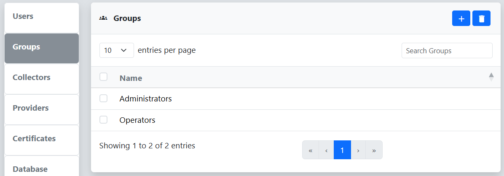
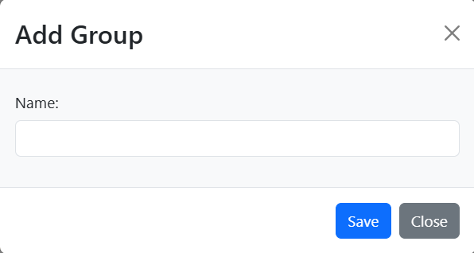
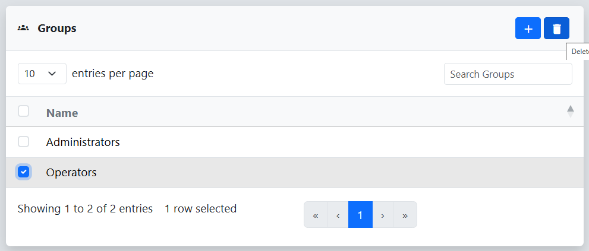
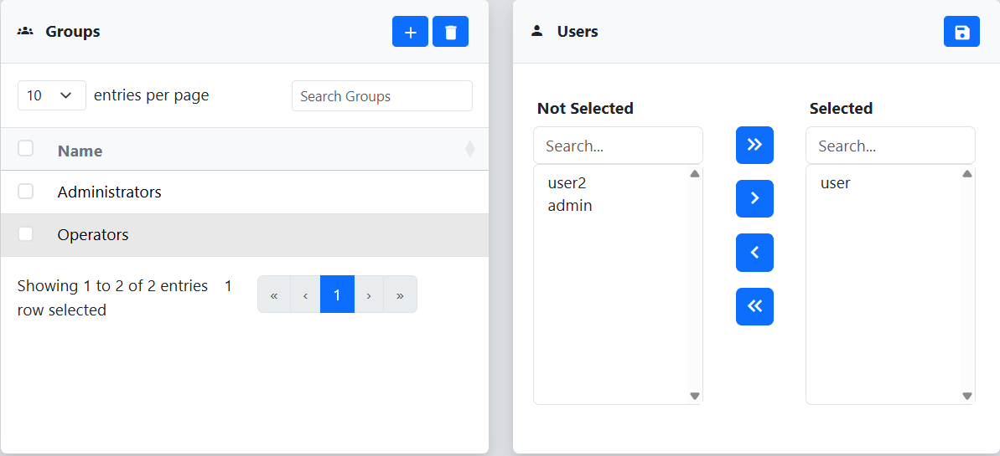

The Groups menu on the Settings page can be used for typical group management operations. Groups exist to provide a mechanism for multiple users to access shared resources such as scans, collectors, targets, etc. 
 
## Add Group
To add a new group to reverge click on the   button in the top right corner of the Groups table.
 
 

 
 
Next, fill out the **Add Group** dialog by entering the new group's name. Then, click **Save**.
 
 

## Remove Group
To remove a group from reverge, select the checkbox to the left of the group in the Groups table and click on the   button in the top right corner.
 
 

## Update Group Settings
To update an existing groups user membership, click on the group in the Groups table. A **Users** dialog will be displayed with two lists. The list of the left side contains all users that are not in the group. THe list of the right contains all users in the group. Use the  and  buttons to move users between the two lists.
 
 

 
 
