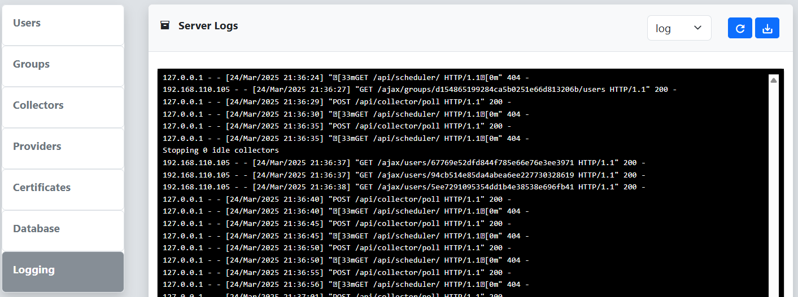

The Logging menu on the Settings page can be used for troubleshooting issues encountered when using reverge. The **Server Logs** dialog displays the last 1000 lines of the reverge server log.
 
 
 

 
 
To manually refresh the logging output click on the   button in the top right corner of the **Server Logs** dialog. To download the log, click on the   button
 
 

