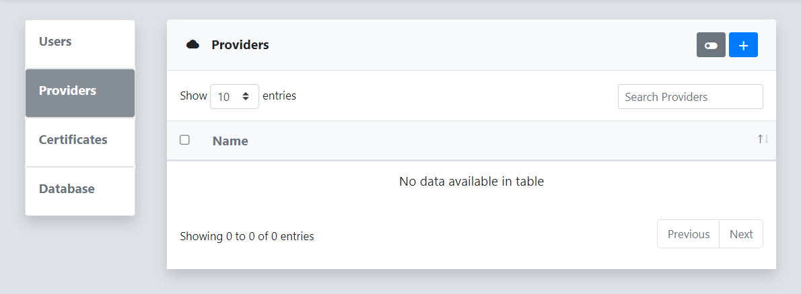
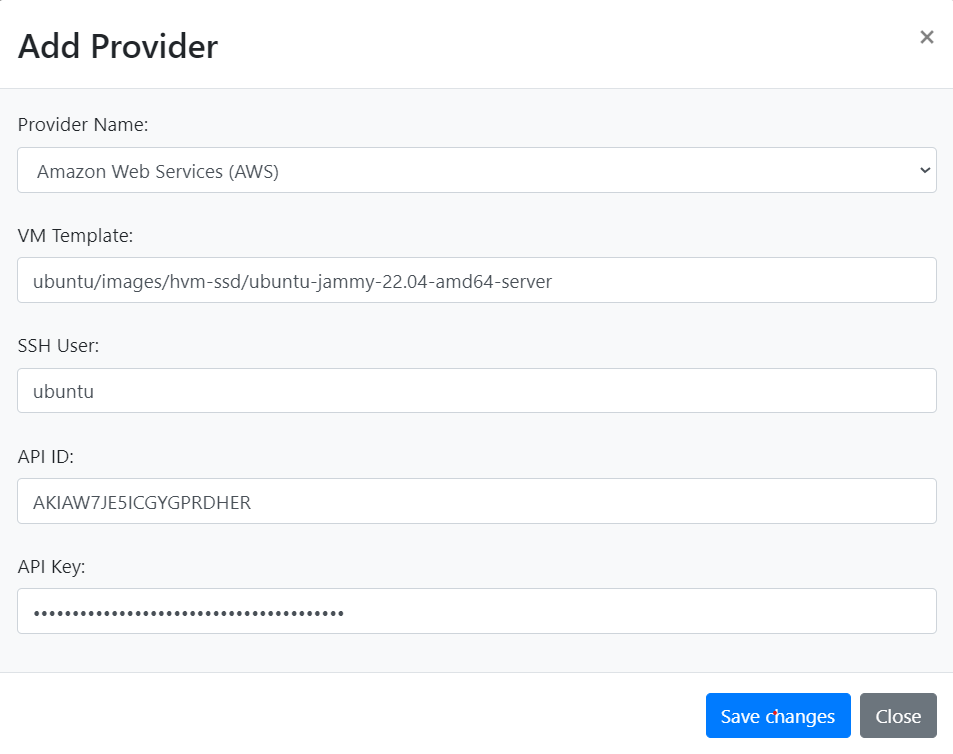
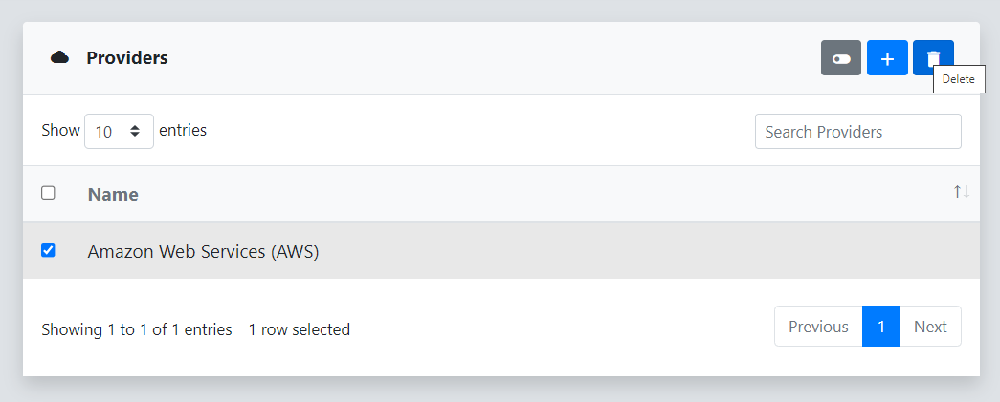

Providers are infrastructure services that provide resources to reverge for instantiating collectors. The most common providers include cloud services like [AWS](https://aws.amazon.com/) and locally hosted virtualization platforms like [Promox](https://www.proxmox.com/). A provider object contains the configuration details required to interact with these services, things like credentials. Setting up a provider is typically the initial step required to create a [collector](/collectors/setup/) for performing scans through reverge.

## Add Provider
To add a new provider to reverge click on the   button in the top right corner of the Providers dialog.
 
 

 
 
Next, populate the fields in the **Add Provider** dialog. For the virtualization providers, this will include an identifier for the VM image to use and the SSH user to be provisioned. Then, click **Save**.
 
 

## Remove Provider
To remove a provider from reverge, select the checkbox to the left of the provider name in the Providers dialog and click on the   button in the top right corner.
 
 

## Credential Management
**By default reverge does not securely store provider credentials in the database**. To add additional protection to the credentials stored in the reverge database it is recommended to setup the proper roles and policies in [AWS Secrets Manager](/#secrets-manager). Once that has been completed, click the  button in the top right corner to enable the use of AWS Secrets Manager to encrypt and decrypt provider credentials.