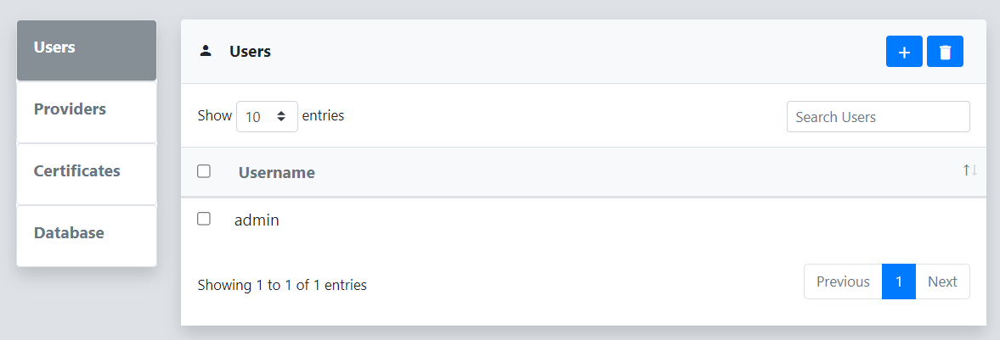

The Users menu on the Settings page can be used for typical user management operations. This includes adding and removing users, updating passwords, and setting their privileges.
 
## Add User
To add a new user to reverge click on the   button in the top right corner of the Users dialog.
 
 

 
 
Next, fill out the **Add User** dialog by entering the new user's username and password, and selecting whether they should have administrator privileges. Then, click **Save**.
 
 

## Remove User
To remove a user from reverge, select the checkbox to the left of the username in the Users dialog and click on the   button in the top right corner.
 
 

## Update User Settings
To update an existing user's password or privileges, click on the user in the Users table. A **Configuration** dialog will be displayed with fields that can be updated for the user. Next click on the   button in the top right corner of the Configuration dialog.
 
 

 
 
To reset the selected user's multi-factor secret, click on the  button. The MFA registration flow will be initiated on the next successful login.
## Profile
Updates to the current user's email address, password, and MFA can be done from the **User->Profile** menu on the top of the screen.
 
 

 
 