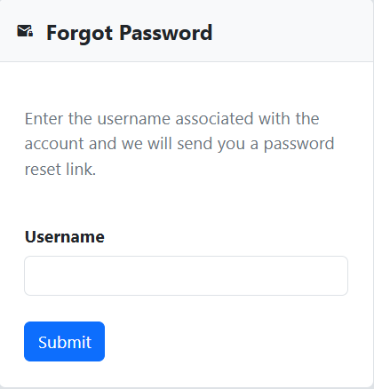
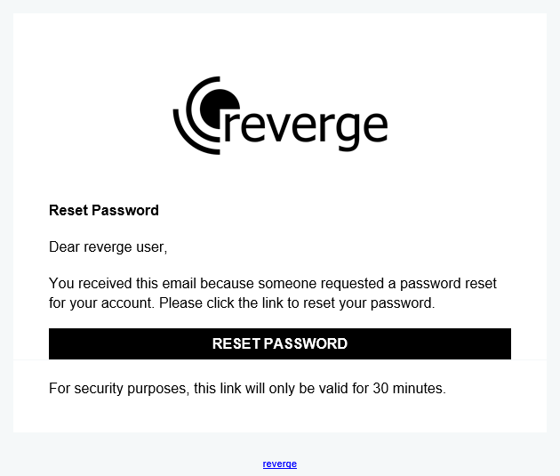
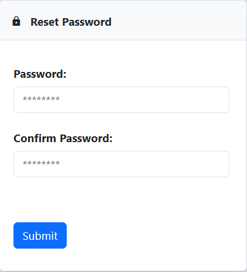
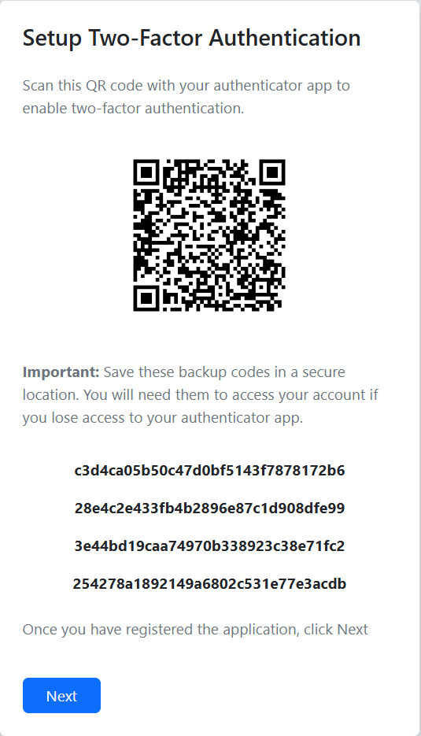
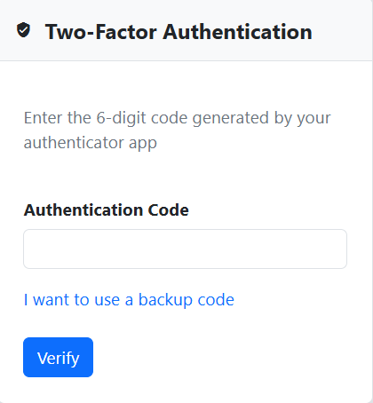
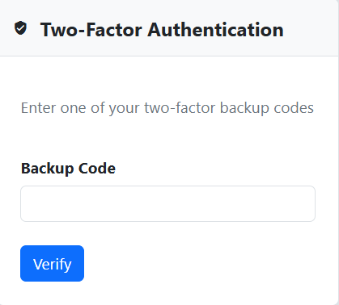

To login to the reverge application, enter the username and password and click the **Login** button.
 
 

 
 
If you’re having trouble logging in or recalling your password, select **Forgot Password**. Enter the reverge username and click the **Submit** button. 
 
 

 
If the username entered has an associated email address, password reset instructions will be sent to that address.
 
 

 
 
Clicking the **Reset Password** button in the email will display a reset password dialog that will allow for updating the user's password. Enter the new password and click the **Submit** button.
 
 

 
 

## Multi-factor Authentication (MFA)
Multi-factor authentication is mandatory for all users to enhance security. Upon first login, the MFA setup page will be displayed with registration instructions for the reverge application in Google Authenticator or a similar app. 
 
 

 
In the event that the user loses access to their authenticator app, backup codes are provided that can be used for one-time login to the reverge application. This provides a mechanism for resetting MFA if necessary. After registering the reverge MFA QR code and saving the backup codes, click the **Next** button.
  
The following dialog will prompt for the authentication code provided by the Authenticator app for the reverge user. Once you have entered the code, click the **Verify** button.
 
 

 
If you have lost access to the authenticator code generator for the reverge user, click **I want to use a backup code** and a dialog will be presented that allows for entering one of the backup codes listed during MFA registration.
 
 

 
 
Enter a backup code and click the **Verify** button to proceed.