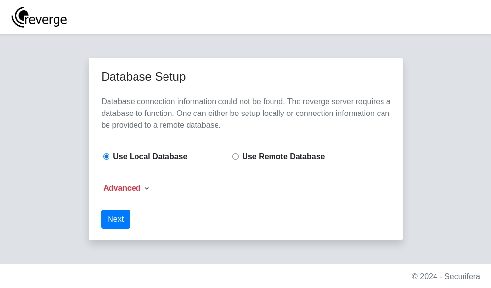
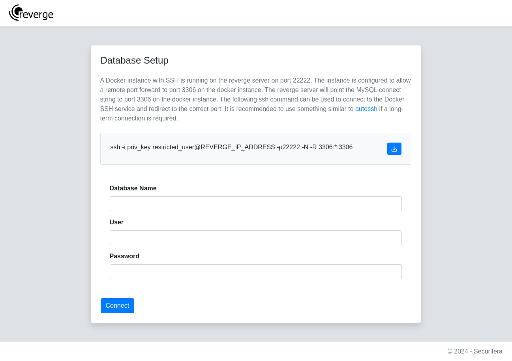
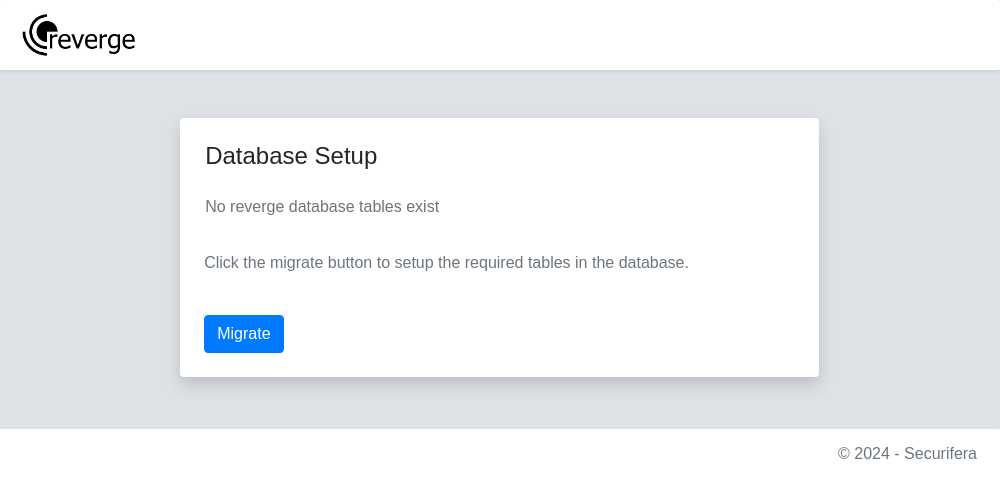
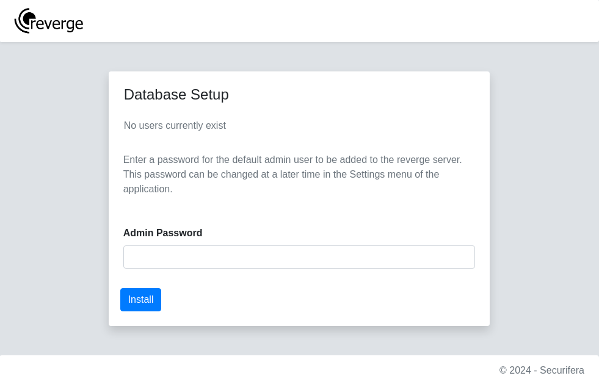
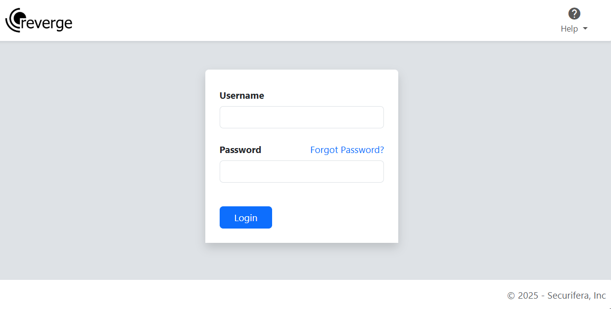

To configure the database for local or remote access, select the appropriate radio button. If an error has occurred during setup and you need to reset the database, click the **Advanced** drop down and select the **Purge Local Database** radio button. Click the **Next** button.
<br>
<br>
<center>

</center>
<br>
<br>
If **Remote Database** is selected, the following page will be displayed. This option allows for self-hosting a MySQL database rather than having it hosted on the reverge server. The page will provide a SSH private key and instructions on how to port forward the self-hosted MySQL database port to the reverge server.  
<br>
!!! note "MySQL docker"

    A compatible MySQL docker can be setup with the following command. This does not include persistent storage.

    ```sh
    docker run -d -p 3306:3306 -e MYSQL_ROOT_PASSWORD="password" -e MYSQL_DATABASE="scan_data" \
        -e MYSQL_USER="db_user" -e MYSQL_PASSWORD="password" mysql:latest
    ```
<br>
After the self-hosted MySQL is installed and configured, execute the provided SSH port forward command from the MySQL server to connect it to the reverge server. Be sure to replace REVERGE_IP_ADDRESS with the reverge server IP address.
<br>
<br>
```
ssh -i priv_key restricted_user@REVERGE_IP_ADDRESS -p22 -N -R 3306:*:3306
```
<br>
Once the connection has been made, enter in the database connection information and click the **Connect** button.
<br>
<br>
<br>
<center>

</center>
<br>
<br>
After the database connection has been configured, the database schema needs to be loaded. On the next page, click the **Migrate** button to load the reverge database tables.
<br>
<br>
<br>
<center>

</center>
<br>
<br>
Once the reverge database tables have been loaded, a password needs to be provided for the **admin** user to complete setup. Enter a sufficiently complex password and click the **Install** button.
<br>
<br>
<br>
<center>

</center>
<br>
<br>
If everything worked as expected, the following login page should appear. Login with the **admin** username and the password provided in the previous step.
<br>
<br>
<br>
<center>

</center>
<br>
<br>
<span style="color: red;">If upgrading from a previous version of reverge, it is highly recommended to proceed with restoring the reverge database by [importing](/settings/database#import-tables) previous data.</span>
<br>
<br>