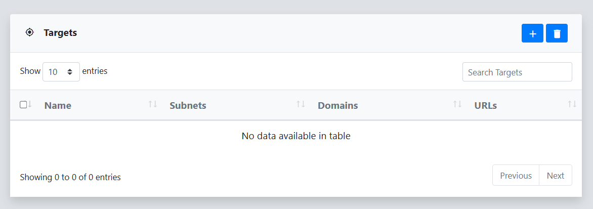

A Target in reverge represents a collection of CIDR blocks, domains, or specific URLs that can be scanned by a reverge collector. The targets menu provides the ability to manage targets. This includes the addition and removal of targets, defining target scope, and scheduling target scans.
 
## Add Target
To create a target in reverge click on the   button in the top right corner of the Targets dialog.
 
 

 
 
Enter a name for the target in the **Add Target** dialog and click **Save**.
 
 
 

## Remove Target
To remove a target from reverge, select the checkbox to the left of the target name in the Targets dialog and click on the   button in the top right corner.
 
 

## Hosts
After setting up the target, you will be taken to the target dashboard. This dashboard displays key metrics about the target and provides a comprehensive list of all detected hosts.
 
 

 
## Scope
The Scope submenu lets you define the target's scope. Subnets, Domains, and URLs can be added to the scope individually by clicking on the respective  button.
 
 

 
 
Target scope can also be imported in bulk by clicking on the  button. The import feature requires a line-delimited scope file. To proceed, click the **Browse** button to select the scope file, then click **Import**.
 
 
 

 
## Scans
The **Scans** submenu within the **Target** page lets you initiate new scans for a specified scope and view results from past scans. The **Scan Schedule** table lists the currently scheduled scans along with their configurations This includes the selected ports, chosen tools, scan recurrence, and the specified collector.
 
 

 
 
To schedule a scan to be executed on the target, click on the click on the  button  in the **Scan Schedule** dialog or the  button on the target dialog menu. The **Network Scan** modal requires multiple parameters be configured before proceeding. First, select a [Collector](/collectors/collectors/) to perform the scan. Then, choose the **Hosts** to scan, which can either be the entire scope or specific IPs or subnets entered manually.. 
 
 

 
 
Likewise, you must select the **Ports** to scan. The drop-down list offers several predefined groups, or you can choose **Custom** to manually enter individual ports. Manually entered **Custom** ports can be space or comma delimited and include ranges, e.g. 1-1000.
 
 
 

 
 
The **Schedule** drop-down list contains options for either a **One Time** scan or setting up a **Recurring** scan by defining the schedule using a cron-like format.
 
 

 
 
The **Passive Collection** container includes tools that gather data about a target from third-party sources without any direct interaction with the target network. The **Active Collection** container lists tools that communicate directly with the target.
  
Each of the selected [Tools](/resources/tools) will run with the default arguments specified in the **Resources**->**Tools** menu. To modify these default arguments for the scan, click on the   button and enter the new arguments in the tool arguments input box. 
 
 
 

 
 
After selecting the scan parameters, click the **Submit** button. This will add an entry to the **Scan Schedule** table.
 
 